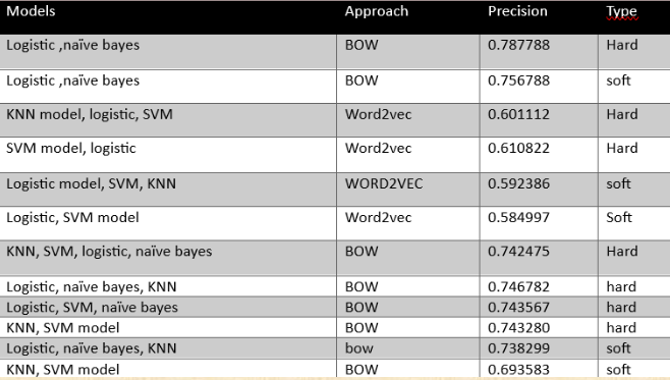

# Twitter Sentiment Analysis
- This project involves a comparative analysis of ensemble modeling of logistic, Naive-bias, SVM, and KNN algorithms using Bag-of-
words and Word2Vec approach.
- The dataset used in the project was the ‘Sentiment140 dataset’ from Kaggle - https://www.kaggle.com/datasets/kazanova/sentiment140
- Following are the steps that were taken during the implementation
  - **Data Collection**: Determining which dataset is best based on Data Diversity, Data Balance, Data Size, Data Quality
  - **Data Visualization**: Gaining the insights of the data by visualizing
    - **Sentiment Distribution**: Pie chart of the number of Sentiment labels (Positive / Negative)
    - **Sentiment Distribution over time**: Sentiments change over time revealing trends or seasonality using a Line graph
    - **Text Length Distribution**: Determining the range within which most sentences fall using Histogram
    - **Density Plot of Text Lengths**: The probability distribution of text lengths using a kernel density estimation(KDE) plot
    - **Sentiment Counts by User**: Identifying users who particularly text positive or negative comments
    - **Word Clouds**: A visual summary of the most common words
  - **Data Preprocessing**:
    - Converting the text to lowercase
    - Removing unnecessary characters, such as punctuation and special symbols
    - Removing numbers or we can say phone numbers
    - Removing stop words, which are common words like "and," "the," and "is"
    - Removing repeating characters 
    - Tokenization
    - Lemmatization
  - **Model Training**
    - Text-to-numerical conversion of data with the help of Bag-of-Words and Word Embedding techniques
    - Training logistic, Naive-bias, SVM, and KNN models on Bag-of-Words and Word Embeddings separately and then using the concept of Ensemble Modelling with hard and soft voting for analysis
  - **Model Testing**
    - Various Combinations of models were tested for each Bag-of-Words and Word Embedding approach
    - Following is the result of analysis
      
    - **Precision metric** was selected because it focuses on eliminating the false positives(people dislike something but it is predicted that they lied it) which can be crucial to eliminate in the case of various applications of sentiment analysis like product recommendation, etc where the product is recommended based on user liking.

